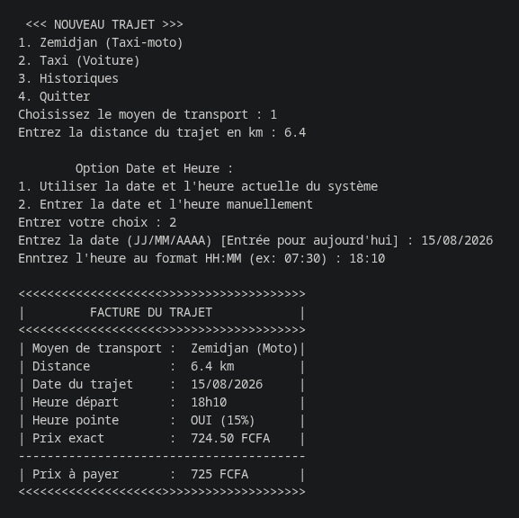
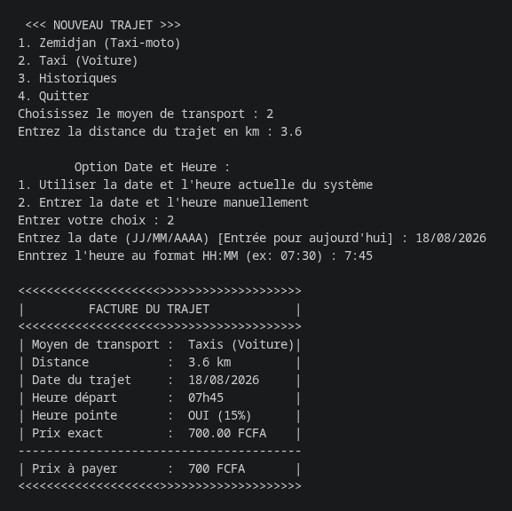
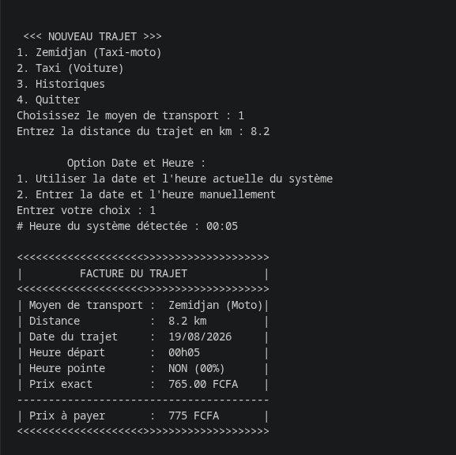
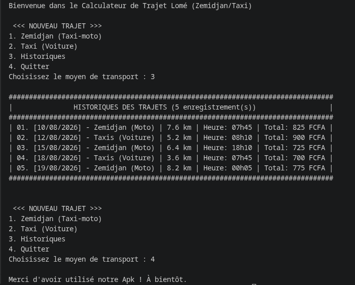

# PyConTogo2026_TaxiZedTrajetCalc

<div align="center">
  Auteur :
    <a>Kossivi Tinè KOSSI</a><br>
  <a class="header-badge" target="_blank" href="https://www.linkedin.com/in/kossivi-tin%C3%A8-kossi-163812337">
  
  </a>
  <a class="header-badge" target="_blank" href="https://github.com/tkossi3">
  
  </a>
  <a class="header-badge" target="_blank" href="https://wa.me/22892010845">
  
  </a>
  <a class="header-badge" target="_blank" href="https://discord.gg/tinos_03_21917">
  
  </a>
  <br>
  Aout - 2026
</div>

# Projet 1 PyCon Togo 2026
## Calculateur de projet de Zemidjan et Taxi en considérant aussi les heures de pointes

## Comment lancé mon projet ?

### Très simple, de un :
 - Il faut Cloner le projet
 - Et, il faut avoir python installer sur sa machine

### Et alors il suffit tout simple de :
 - Lancé le main.py, en exécutant
 ```python main.py```


## Exemple d'execution
<div>
    <h3>Enregistrement d'un trajet avec zemidjan - Saisie de la date et heure par l'utilisateur</h3>
    
    <h3>Enregistrement d'un trajet avec taxi - Saisie de la date et heure par l'utilisateur</h3>
    
    <h3>Enregistrement d'un trajet avec zemidjan - Optention automatique de la date et heure du système</h3>
    
    <h3>Entré dans le programme, affichage de l'historique, sortie du programme</h3>
    
</div>
